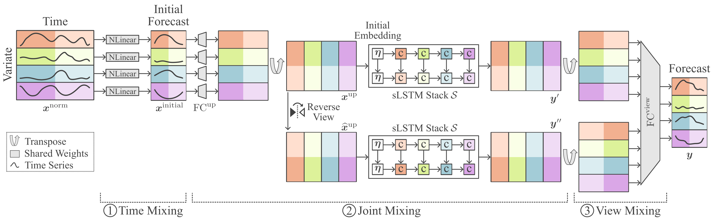

# xLSTM-Mixer



This repository provides the supplemental code for the paper **"xLSTM-Mixer: Multivariate Time Series Forecasting by Mixing via Scalar Memories"**.

[](https\://arxiv.org/abs/2410.16928)

## Table of Contents

1. [Datasets](#used-datasets)
2. [Setup](#setup)
   - [Non-Docker Installation](#non-docker-installation)
   - [Docker Installation](#docker-installation)
   - [VSCode Environment](#vscode-environment)
   - [CUDA Requirements](#cuda-requirements)
3. [Running the Project](#running-the-project)
4. [Experiments](#experiments)
   - [Quick Experiment Check](#quick-experiment-check)
   - [Example Commands](#example-commands)
5. [Citation](#citation)

## Used Datasets

We used commonly available benchmark datasets, which can be downloaded from [Google Drive](https://drive.google.com/drive/folders/1B6BP6fA6j29azC-BJyDLDtfNzxT8cK2Y?usp=sharing).
The environment expects the benchmark datasets to be located in the `/common-ts` directory on a Linux-based system or container.


## Setup

*Note: This package is based on PyTorch 2.4 and was tested with Python 3.11.*

### Non-Docker Installation

The code was tested on an Ubuntu 22.04 machine with CUDA 12.1. The Python requirements are listed in `requirements.txt` and `lighting_requirements.txt`. Both can be installed using pip:

```bash
pip install -r requirements.txt
pip install -r lighting_requirements.txt
```

### Docker Installation

The repository contains a Dockerfile to install the required environment. You can build the Docker image and run a container to ensure consistency across setups.

#### Build the Container

```bash
docker build -t xlstm-mixer-code -f .docker/Dockerfile .
```

#### Attach to the Container

```bash
docker run --gpus device=0 -it -v /storage-01/common-ts:/common-ts -v $(pwd):/workspaces/xlstm_mixer xlstm-mixer-code bash
```

### VSCode Environment

The repository also includes a `devcontainer.json`, allowing you to attach to the project using VSCode for a consistent development environment. The source path needs to be adapted according to ones system. 


### CUDA Requirements

For the CUDA version of sLSTM, a Compute Capability of 8.0 or higher is required. For more details on CUDA support, check [this list](https://developer.nvidia.com/cuda-gpus) (e.g., A100 GPUs are supported).

## Running the Project

The project provides a Lightning-based CLI, which is also used for the experiments in the `scripts` folder. To get general help on utilizing the CLI, run:

```bash
python -m xlstm_mixer --help
```

For specific model or data argument configurations, use:

```bash
python -m xlstm_mixer fit --help
```

## Experiments

Predefined scripts with hyperparameters are available in the `scripts` folder.

### Quick Experiment Check

To verify that all requirements are met, pass the `--dev` flag to any script, e.g.,

```bash
bash ./scripts/long_term_forecasting/ett/m1.sh --dev
```

This will run a test batch to confirm the setup is functioning correctly. Full seed runs are organized by dataset in the `scripts` folder.

### Example Commands

Run the following scripts for specific experiments:

```bash
bash ./scripts/long_term_forecasting/weather.sh
```

```bash
bash ./scripts/long_term_forecasting/ett/m1.sh
```

## Citation

If you find this work helpful, please consider citing our paper using the following BibTeX entry:

```bibtex
@article{krausxLSTM-Mixer2024,
  author    = {Maurice Kraus and Felix Divo and Devendra Singh Dhami and Kristian Kersting},
  title     = {xLSTM-Mixer: Multivariate Time Series Forecasting by Mixing via Scalar Memories},
  journal   = {arXiv preprint},
  year      = {2024},
  url       = {https://arxiv.org/abs/2410.16928},
}
```

---

Feel free to suggest further additions or clarifications if needed. I'm here to help! 😊

